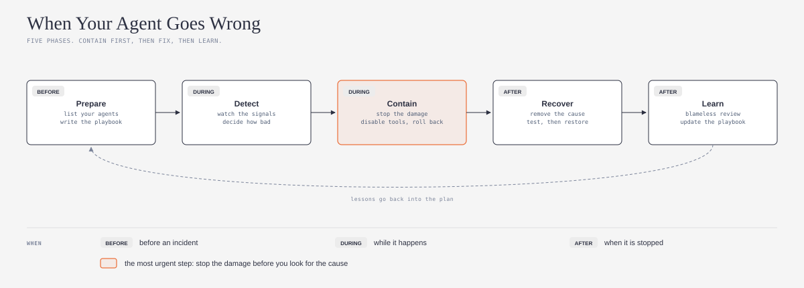
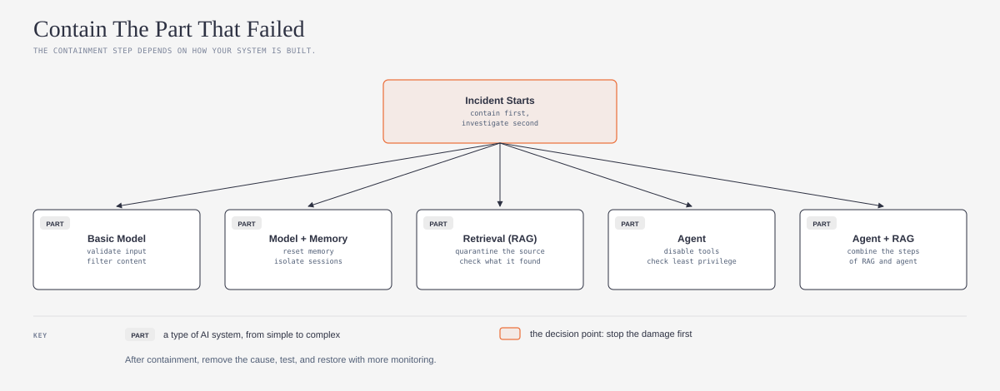
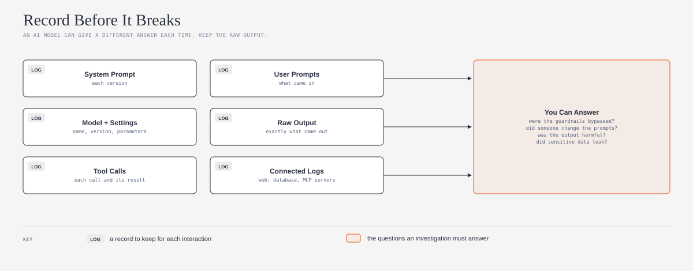

# ai-incident-response-explained

## What is it?

This repository is a simple guide and a ready-made skill for your AI agent. Both are based on the AI Incident Response Framework, V1.0, from the Coalition for Secure AI (CoSAI). The framework tells you how to prepare for an AI incident, how to find it, how to stop it, and how to learn from it.



*Do you want simple meanings for the technical words? Refer to the [Jargon Buster](JARGON.md).*

## What problem does it solve?

An AI agent can go wrong in ways that normal software does not. A prompt injection can make it use its tools against you. Bad data can change what it says. The same input can give a different answer each time, so you cannot always replay the problem. If you do not have a plan, you lose time when the agent goes wrong. This guide helps you make a short plan before an incident occurs.

## Who is it for?

This guide is for small teams, teams that grow quickly, and solo builders who put AI agents into real work. You do not need to be a specialist in risk, cybersecurity, governance, or safety. For example, an agent that answers customers, changes code, or uses business tools. The source framework was written for security teams in large organizations. This guide makes it smaller, so that one person or a small team can use it.

You do not need to write code to use the skill. The skill uses the open [Agent Skills](https://agentskills.io) format (`SKILL.md`), so it works with Claude, Codex, GitHub Copilot, and other AI agents that support this format.

## Safe by default

1. **Read and draft first.** The skill reads your project and writes a draft plan. It does not change your agent, your logs, or your settings before you approve.
2. **No secret keys in the chat.** The skill never asks for a key, a token, or a password. Do not paste them into the chat.
3. **Honest results.** The skill tells you which records you do not keep today. It does not say that your agent is ready when the evidence is missing.
4. **Your files stay yours.** The plan goes into your project folder. You can read, change, or delete it at any time.

## What does it do?

Ask your AI agent to make an incident plan for your agent. The skill helps your AI agent to do these steps:

1. Make a list of your agents, with an owner, the data each one uses, and how important it is
2. Find the type of system that each agent is: a basic model, a model with memory, retrieval (RAG), an agent, or an agent with retrieval
3. Write the first containment step for each type, before an incident occurs
4. Find the records that you keep today, and the records that are missing
5. Write who decides what during an incident, even if one person does all the roles
6. Write a short playbook for one likely incident, such as a prompt injection

The skill also looks for three frequent mistakes. The first mistake is no person with the authority to stop the agent. The second mistake is logs that do not keep the raw output of the model. The third mistake is a review that looks for a person to blame, and not for the cause.

## How does it work?

*The diagrams below use the visual language of [cathrynlavery/diagram-design](https://github.com/cathrynlavery/diagram-design):*



When an incident starts, stop the damage first. Then look for the cause. The correct first step depends on how your system is built. For an agent, the framework tells you to disable tools and to check least privilege. For a system with memory, it tells you to reset the memory and isolate the sessions. After containment, remove the cause, test the system, and restore it, and then watch it closely for a period.



You can only investigate what you recorded. An AI model can give a different answer to the same input, so keep the raw output. The framework also tells you to keep the tool calls, because an agent acts through its tools. Decide what to keep and for how long when you build the agent, not after the incident.

For automatic limits that stop a runaway agent, refer to [RiskKernel](https://github.com/prashar32/riskkernel) by [prashar32](https://github.com/prashar32). It sets cost, loop, and time limits and can pause for human approval. This guide does not explain RiskKernel. It is a link only.

## How to install

First, make a folder with the name `ai-incident-response`. Put `SKILL.md` from this repository in that folder. Then do the steps for your AI agent.

### One command for all agents

If you have Node.js, run this command in a terminal. The command installs the skill for Claude Code, Codex, GitHub Copilot, and other agents.

```
npx skills add ams-builds/ai-incident-response-explained
```

To get the latest version later, run `npx skills update`. The command uses [skills](https://github.com/vercel-labs/skills) by [Vercel](https://github.com/vercel-labs). If you do not use a terminal, use the instructions for your agent below.

### Claude

1. In claude.ai or the Claude desktop app, make a zip file of the `ai-incident-response` folder.
2. Upload the zip file in **Settings > Capabilities > Skills**.
3. In Claude Code, put the folder in `~/.claude/skills/ai-incident-response/`.

### Codex

1. Put the folder in `~/.agents/skills/ai-incident-response/` for all your projects.
2. Or, put the folder in `.agents/skills/ai-incident-response/` in one project.
3. Or, tell Codex to use `$skill-installer` with the GitHub URL of this repository.
4. If the skill does not show, start Codex again. Source: [Codex skills documentation](https://learn.chatgpt.com/docs/build-skills).

### GitHub Copilot

1. Put the folder in `~/.copilot/skills/ai-incident-response/` for all your projects.
2. Or, put the folder in `.github/skills/ai-incident-response/` in one repository.
3. Use Copilot in agent mode. Source: [GitHub Copilot skills documentation](https://docs.github.com/en/copilot/how-tos/copilot-cli/customize-copilot/create-skills).

These three agents are the most used AI coding agents in the [JetBrains 2026 survey](https://blog.jetbrains.com/research/2026/08/ai-coding-agent-adoption-2026/). Other agents that support Agent Skills use the same `SKILL.md` file. Refer to the documentation of your agent for the folder.

## How to use it

After you install the skill, speak to your AI agent in your usual words:

- "Make an incident response plan for my agent"
- "What do I do if my agent gets a prompt injection?"
- "Which logs must I keep for an AI incident?"

The skill starts automatically. You do not need to use its name.

## Credit and license

This guide is based on the [AI Incident Response Framework, V1.0](https://github.com/cosai-oasis/ws2-defenders/blob/main/incident-response/AI-Incident-Response.md) by [CoSAI](https://github.com/cosai-oasis) Workstream 2, Preparing Defenders for a Changing Cybersecurity Landscape. CoSAI is an [OASIS Open](https://github.com/oasis-open) project. The CoSAI Project Governing Board approved V1.0 on 27 October 2025. This guide explains the source at commit `b8dbec1` (6 October 2026) of [cosai-oasis/ws2-defenders](https://github.com/cosai-oasis/ws2-defenders).

The source repository uses the Apache License 2.0. Its README states CC BY 4.0 for documentation. The document has its own OASIS copyright notice, which permits derivative works that explain it, if the notice is included. This repository uses the Apache License 2.0 and includes the OASIS notice. Refer to [LICENSE](LICENSE) and [NOTICE](NOTICE).

This is an independent guide. It is not an official part of CoSAI or OASIS. For the full framework, use the source document.

Changes from the source:

1. I wrote the main concepts again in Simplified Technical English, for small teams and solo builders who are not security specialists.
2. I made three new diagrams.
3. I wrote an agent skill that helps one person or a small team make an incident plan.
4. I did not copy the playbooks, the case studies, or the architecture tables. The skill refers to them by their section numbers in the source document.

**Language.** I wrote the text in Simplified Technical English (ASD-STE100). The idea to ask an AI model to write in ASD-STE100 comes from [Andrej Karpathy](https://github.com/karpathy) ([his post on X](https://x.com/karpathy/status/2105819303471976479)). I used the [simplified-technical-english](https://github.com/0xpili/simplified-technical-english) agent skill by [pili](https://github.com/0xpili) to write and check the text. ASD-STE100 is a specification of ASD (AeroSpace and Defence Industries Association of Europe). This repository is not related to ASD.

---

*New words? The [Jargon Buster](JARGON.md) gives simple explanations of containment, playbook, blast radius, prompt injection, forensics, and more.*
